# Chucky - Intelligent Photo Organization System

An advanced n8n workflow automation system for intelligent photo categorization, organization, and conversational querying using AI.

## 🎯 Overview

Chucky automatically processes images from Google Drive, analyzes them using Google Gemini AI, stores metadata in Supabase vector database, and provides a conversational RAG (Retrieval Augmented Generation) interface through Discord and Telegram bots.

### Key Features

- **Automated Photo Processing** - Monitors Google Drive folders and processes images automatically
- **AI-Powered Categorization** - Uses Google Gemini Vision for intelligent image analysis
- **Vector Search** - Supabase pgvector for semantic photo search
- **Conversational Interface** - Ask questions about your photos via Discord/Telegram
- **Payment & Quota Management** - Stripe integration for premium features
- **User Authentication** - Secure user management system
- **Analytics & Monitoring** - Comprehensive tracking and insights

## 🚀 Quick Start

### Prerequisites

- n8n instance (v1.x or higher)
- Google Drive account with API access
- Supabase account
- Google Gemini API key
- Discord/Telegram bot (optional)

### Installation

1. Clone this repository:
```bash
git clone https://github.com/hharp/chucky_project.git
cd chucky_project
```

2. Import workflows into n8n:
   - Open your n8n instance
   - Go to **Workflows** → **Import from File**
   - Select the desired `.json` workflow file

3. Configure credentials in n8n (see [Setup Guide](./GITHUB_SETUP.md))

4. Activate the workflows

## 📁 Project Structure

```
chucky_project/
├── .github/
│   ├── workflows/           # GitHub Actions CI/CD workflows
│   │   ├── ci-validate.yml         # Validates workflow JSON
│   │   ├── cd-deploy-staging.yml   # Auto-deploy to staging
│   │   ├── issueops-production.yml # Deploy via GitHub Issues
│   │   ├── security-scan.yml       # Security scanning
│   │   └── cron-maintenance.yml    # Weekly maintenance tasks
│   └── ISSUE_TEMPLATE/      # Issue templates for work orders
│       ├── new_workflow.yml        # New workflow requests
│       ├── bug_report.yml          # Bug reports
│       ├── deployment.yml          # Deployment checklists
│       └── config.yml              # Template configuration
│
├── ChuckyDiscordRAG.json           # Main Discord RAG workflow
├── ChuckyTelegramLocal.json        # Telegram bot workflow
├── Payment_Management_Workflow.json # Payment processing
├── User_Auth_Workflow.json         # User authentication
├── Quota_Enforcement_Workflow.json # Quota management
├── Premium_Features_Workflow.json  # Premium feature access
├── Monitoring_Analytics_Workflow.json # Analytics tracking
├── Security_Compliance_Workflow.json  # Security checks
├── Stripe_Webhook_Handler.json     # Stripe webhook handler
├── Monthly_Quota_Reset.json        # Quota reset automation
│
├── CLAUDE.md                # Project documentation for Claude Code
├── GITHUB_SETUP.md          # GitHub Actions setup guide
├── CONTRIBUTING.md          # Contribution guidelines
└── README.md               # This file
```

## 🔄 GitHub Actions CI/CD

This project uses GitHub Actions for automated workflow validation, testing, and deployment.

### Workflows

#### 1. **CI - Validate Workflows** (`ci-validate.yml`)
- **Trigger:** On pull requests and pushes to main
- **Purpose:** Validates workflow JSON structure and scans for credentials
- **Features:**
  - JSON syntax validation
  - Required field verification
  - Credential exposure detection
  - Automated PR comments with results

#### 2. **CD - Deploy to Staging** (`cd-deploy-staging.yml`)
- **Trigger:** Automatically on merge to main
- **Purpose:** Deploys workflows to staging n8n instance
- **Features:**
  - Auto-detects changed workflow files
  - Deploys only modified workflows
  - Creates issues on deployment failure
  - Comments on related PRs

#### 3. **IssueOps - Deploy to Production** (`issueops-production.yml`)
- **Trigger:** When issue is labeled with `deploy-to-prod`
- **Purpose:** Controlled production deployment via GitHub Issues
- **Features:**
  - Manual approval required (GitHub Environment protection)
  - Parses workflow files from issue body
  - Real-time deployment status updates
  - Post-deployment verification checklist

#### 4. **Security Scan** (`security-scan.yml`)
- **Trigger:** On push, PR, and weekly schedule (Sundays 2 AM UTC)
- **Purpose:** Scans for exposed credentials and security issues
- **Features:**
  - TruffleHog secret scanning
  - Pattern matching for API keys, tokens, passwords
  - Auto-creates security issues for findings
  - Workflow permission audits

#### 5. **Weekly Maintenance** (`cron-maintenance.yml`)
- **Trigger:** Every Monday at 9 AM UTC
- **Purpose:** Creates weekly maintenance checklist issues
- **Features:**
  - Comprehensive workflow health checks
  - Database and API status verification
  - Security and credential audits
  - Performance and cost analysis

### Deployment Process

#### Development Flow

```mermaid
graph LR
    A[Create Feature Branch] --> B[Make Changes]
    B --> C[Push to GitHub]
    C --> D[CI Validation]
    D --> E{Valid?}
    E -->|Yes| F[Create PR]
    E -->|No| B
    F --> G[Code Review]
    G --> H[Merge to Main]
    H --> I[Auto-Deploy to Staging]
    I --> J[Test in Staging]
    J --> K[Create Deployment Issue]
    K --> L[Add 'deploy-to-prod' Label]
    L --> M[Manual Approval]
    M --> N[Deploy to Production]
    N --> O[Verify & Monitor]
```



#### Quick Deployment

**For Staging:**
1. Merge PR to `main` branch
2. Staging deployment happens automatically
3. Monitor GitHub Actions workflow run

**For Production:**
1. Create deployment issue (use template)
2. List workflow files in issue body
3. Add label `deploy-to-prod`
4. Approve deployment when prompted
5. Complete post-deployment checklist

### Issue Templates

#### 🔧 New Workflow Request
Request creation of a new n8n workflow with structured requirements.

#### 🐛 Bug Report
Report issues with existing workflows including error details and reproduction steps.

#### 🚀 Deployment Checklist
Track pre-deployment, deployment, and post-deployment tasks with comprehensive checklists.

### GitHub Actions Status


## 🔐 Security

### Credential Management

- **Never commit credentials** to the repository
- Use **GitHub Secrets** for API keys in GitHub Actions
- Use **n8n Credential Manager** for workflow credentials
- Rotate credentials every 90 days

### Required Secrets

Configure these in **Settings** → **Secrets and variables** → **Actions**:

```
N8N_URL                # Production n8n instance URL
N8N_API_KEY           # Production n8n API key
N8N_STAGING_URL       # Staging n8n instance URL (optional)
N8N_STAGING_API_KEY   # Staging n8n API key (optional)
```

### Security Scanning

Weekly automated security scans check for:
- Exposed API keys and tokens
- Hardcoded passwords
- Bearer tokens
- Service-specific credentials (Google, OpenAI, Stripe, Discord, etc.)

## 📊 Workflows

### Core Workflows

| Workflow | Purpose | Trigger |
|----------|---------|---------|
| `ChuckyDiscordRAG.json` | Discord bot with RAG for photo queries | Discord commands |
| `ChuckyTelegramLocal.json` | Telegram bot interface | Telegram messages |
| `Payment_Management_Workflow.json` | Stripe payment processing | Stripe webhooks |
| `User_Auth_Workflow.json` | User authentication and management | API calls |
| `Quota_Enforcement_Workflow.json` | Usage quota tracking | User actions |
| `Premium_Features_Workflow.json` | Premium feature access control | User requests |
| `Monitoring_Analytics_Workflow.json` | Analytics data collection | Scheduled |
| `Security_Compliance_Workflow.json` | Security checks | Scheduled |

### Supporting Workflows

| Workflow | Purpose | Trigger |
|----------|---------|---------|
| `Stripe_Webhook_Handler.json` | Handle Stripe webhook events | Stripe |
| `Monthly_Quota_Reset.json` | Reset user quotas monthly | Scheduled |

## 🛠️ Development

### Local Development

1. **Test workflows locally** in n8n before committing
2. **Validate JSON** before pushing:
```bash
jq empty workflow.json && echo "Valid JSON" || echo "Invalid JSON"
```

3. **Check for credentials**:
```bash
grep -rE "(sk-|api_key|token)" *.json
```

### Contributing

See [CONTRIBUTING.md](./CONTRIBUTING.md) for detailed contribution guidelines.

### Creating a New Workflow

1. Create issue using **New Workflow Request** template
2. Develop workflow in n8n instance
3. Export workflow JSON
4. Create feature branch
5. Add workflow JSON to repository
6. Create PR with description
7. After merge, deploy using deployment issue

### Reporting Bugs

1. Create issue using **Bug Report** template
2. Include error messages and reproduction steps
3. Add severity and affected workflow
4. Assign appropriate labels

## 📈 Monitoring

### Workflow Metrics

Monitor these key metrics:
- **Execution Success Rate** (target: >99%)
- **Average Response Time** (target: <30s for image analysis)
- **Error Rate** (target: <1%)
- **API Quota Usage** (Google Gemini, xAI Grok)

### Error Handling

All workflows include:
- Retry logic for transient failures
- Error notifications via Discord
- Detailed error logging
- Graceful degradation

## 🔗 Integration

### Google Drive

- OAuth2 authentication
- Webhook-based triggers (instant processing)
- Folder monitoring for new images
- Automatic file organization

### Google Gemini AI

- Image analysis with `gemini-1.5-pro-latest` and `gemini-2.0-flash-exp`
- Structured JSON responses
- Category and metadata extraction
- Embeddings for vector search

### Supabase

- PostgreSQL database for metadata
- pgvector for semantic search
- Real-time subscriptions
- Row-level security

### Discord/Telegram

- Bot commands for photo queries
- Image upload and analysis
- Conversational RAG interface
- Real-time notifications

### Stripe

- Payment processing
- Subscription management
- Webhook handling
- Usage-based billing

## 📝 Documentation

- **[CLAUDE.md](./CLAUDE.md)** - Comprehensive project documentation
- **[GITHUB_SETUP.md](./GITHUB_SETUP.md)** - GitHub Actions setup guide
- **[CONTRIBUTING.md](./CONTRIBUTING.md)** - Contribution guidelines
- **n8n Documentation** - https://docs.n8n.io

## 🤝 Support

- **Issues:** Use GitHub Issues with appropriate templates
- **Discussions:** GitHub Discussions for questions
- **Documentation:** Check CLAUDE.md for detailed info

## 📜 License

This project is private and not licensed for public use.

## 👤 Author

**hharp**

## 🙏 Acknowledgments

- n8n team for the amazing workflow automation platform
- Google Gemini for powerful AI capabilities
- Supabase for excellent database and vector store
- xAI for Grok chat model
